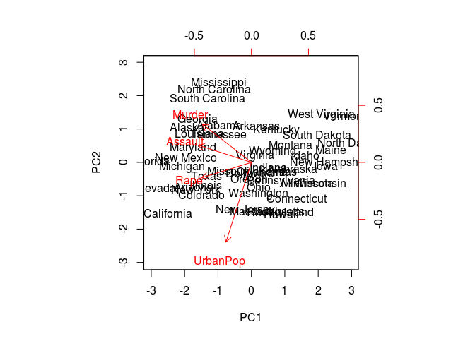
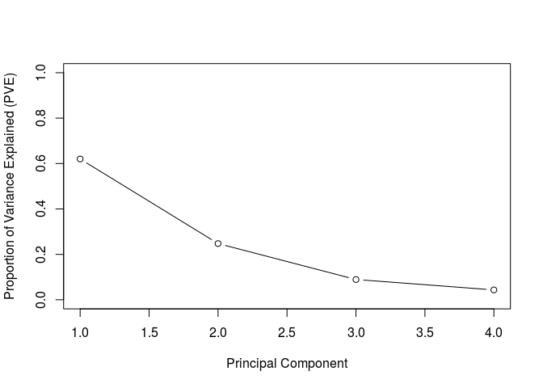
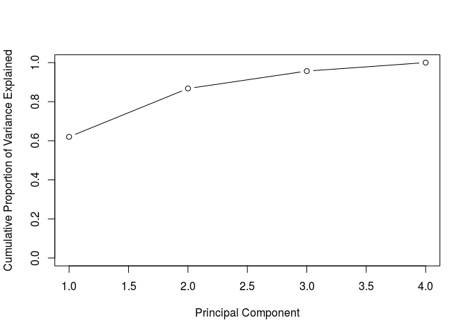

Lab of Chapter 10
================

-   [Lab 1: Principal Component Analysis](#lab-1-principal-component-analysis)
-   [Lab 2: Clustering](#lab-2-clustering)
    -   [K-Means Clustering](#k-means-clustering)
        -   [Hierarchical Clustering](#hierarchical-clustering)

Lab 1: Principal Component Analysis
===================================

Calculate mean and variance of each feature of *USArrests* data set:

``` r
row.names(USArrests)
```

    ##  [1] "Alabama"        "Alaska"         "Arizona"        "Arkansas"      
    ##  [5] "California"     "Colorado"       "Connecticut"    "Delaware"      
    ##  [9] "Florida"        "Georgia"        "Hawaii"         "Idaho"         
    ## [13] "Illinois"       "Indiana"        "Iowa"           "Kansas"        
    ## [17] "Kentucky"       "Louisiana"      "Maine"          "Maryland"      
    ## [21] "Massachusetts"  "Michigan"       "Minnesota"      "Mississippi"   
    ## [25] "Missouri"       "Montana"        "Nebraska"       "Nevada"        
    ## [29] "New Hampshire"  "New Jersey"     "New Mexico"     "New York"      
    ## [33] "North Carolina" "North Dakota"   "Ohio"           "Oklahoma"      
    ## [37] "Oregon"         "Pennsylvania"   "Rhode Island"   "South Carolina"
    ## [41] "South Dakota"   "Tennessee"      "Texas"          "Utah"          
    ## [45] "Vermont"        "Virginia"       "Washington"     "West Virginia" 
    ## [49] "Wisconsin"      "Wyoming"

``` r
names(USArrests)
```

    ## [1] "Murder"   "Assault"  "UrbanPop" "Rape"

``` r
apply(USArrests, 2, mean)
```

    ##   Murder  Assault UrbanPop     Rape 
    ##    7.788  170.760   65.540   21.232

``` r
apply(USArrests, 2, var)
```

    ##     Murder    Assault   UrbanPop       Rape 
    ##   18.97047 6945.16571  209.51878   87.72916

Perform PCA on this data set with standardization beforehand:

``` r
pr.out <- prcomp(USArrests, scale. = TRUE)
names(pr.out)
```

    ## [1] "sdev"     "rotation" "center"   "scale"    "x"

Note there is a dot after the `scale` in the parameter name of function `prcomp()`.

List mean and standard deviation of each feature (which are used to *standardize* a vector):

``` r
pr.out$center
```

    ##   Murder  Assault UrbanPop     Rape 
    ##    7.788  170.760   65.540   21.232

``` r
pr.out$scale
```

    ##    Murder   Assault  UrbanPop      Rape 
    ##  4.355510 83.337661 14.474763  9.366385

Note these results are exactly the same with above calculations with `apply()`, for a vector's *standard deviation* is the square root of its *variance*.

The result of `prcomp()` also has a `sdev` output (see `pr.out$sdev`), which is the standard deviation of the principal components instead of origin features.

List the *loading vectors* (each column defines a coordinate axis that the origin features have maximum variance on it):

``` r
pr.out$rotation
```

    ##                 PC1        PC2        PC3         PC4
    ## Murder   -0.5358995  0.4181809 -0.3412327  0.64922780
    ## Assault  -0.5831836  0.1879856 -0.2681484 -0.74340748
    ## UrbanPop -0.2781909 -0.8728062 -0.3780158  0.13387773
    ## Rape     -0.5434321 -0.1673186  0.8177779  0.08902432

Study the principal component score vectors:

``` r
dim(pr.out$x)
```

    ## [1] 50  4

``` r
biplot(pr.out, scale = 0)
```



Notice that this figure is a mirror image of Figure 10.1. But their meaning keep the same: *Murder*, *Assault* and *Rape* are the (equal) dominant of PC1, while *UrbanPop* is the dominant of PC2.

The variance explained by each principal component (PC) is obtained by squaring the standard deviation of each PC. Hence we can get the *PVE* of this group PCs:

``` r
pr.var <- pr.out$sdev ^ 2
pve <- pr.var / sum(pr.var)
pve
```

    ## [1] 0.62006039 0.24744129 0.08914080 0.04335752

So the first principal component explains 62.0 % of the variance in the data, the next principal component explains 24.7 % of the variance, and so forth. We can plot the PVE explained by each component, as well as the cumulative PVE, as follows:

``` r
plot(pve, xlab = "Principal Component", ylab = "Proportion of Variance Explained (PVE)", ylim = c(0,1), type = 'b')
```



``` r
plot(cumsum(pve), xlab = 'Principal Component', ylab = "Cumulative Proportion of Variance Explained", ylim = c(0,1), type = 'b')
```



Finally a demo for function `cumsum()`:

``` r
v <- c(1, 3, 5, 20, -5)
cumsum(v)
```

    ## [1]  1  4  9 29 24

Lab 2: Clustering
=================

K-Means Clustering
------------------

### Hierarchical Clustering
