Lab of Chapter 10
================

-   [Lab 1: Principal Component Analysis](#lab-1-principal-component-analysis)
-   [Lab 2: Clustering](#lab-2-clustering)
    -   [K-Means Clustering](#k-means-clustering)
    -   [Hierarchical Clustering](#hierarchical-clustering)
-   [Lab 3: NCI60 Data Example](#lab-3-nci60-data-example)
    -   [PCA on the NCI60 Data](#pca-on-the-nci60-data)
    -   [Clustering the Observations of the NCI60 Data](#clustering-the-observations-of-the-nci60-data)

Lab 1: Principal Component Analysis
===================================

Calculate mean and variance of each feature of *USArrests* data set:

``` r
row.names(USArrests)
```

    ##  [1] "Alabama"        "Alaska"         "Arizona"        "Arkansas"      
    ##  [5] "California"     "Colorado"       "Connecticut"    "Delaware"      
    ##  [9] "Florida"        "Georgia"        "Hawaii"         "Idaho"         
    ## [13] "Illinois"       "Indiana"        "Iowa"           "Kansas"        
    ## [17] "Kentucky"       "Louisiana"      "Maine"          "Maryland"      
    ## [21] "Massachusetts"  "Michigan"       "Minnesota"      "Mississippi"   
    ## [25] "Missouri"       "Montana"        "Nebraska"       "Nevada"        
    ## [29] "New Hampshire"  "New Jersey"     "New Mexico"     "New York"      
    ## [33] "North Carolina" "North Dakota"   "Ohio"           "Oklahoma"      
    ## [37] "Oregon"         "Pennsylvania"   "Rhode Island"   "South Carolina"
    ## [41] "South Dakota"   "Tennessee"      "Texas"          "Utah"          
    ## [45] "Vermont"        "Virginia"       "Washington"     "West Virginia" 
    ## [49] "Wisconsin"      "Wyoming"

``` r
names(USArrests)
```

    ## [1] "Murder"   "Assault"  "UrbanPop" "Rape"

``` r
apply(USArrests, 2, mean)
```

    ##   Murder  Assault UrbanPop     Rape 
    ##    7.788  170.760   65.540   21.232

``` r
apply(USArrests, 2, var)
```

    ##     Murder    Assault   UrbanPop       Rape 
    ##   18.97047 6945.16571  209.51878   87.72916

Perform PCA on this data set with standardization beforehand:

``` r
pr.out <- prcomp(USArrests, scale. = TRUE)
names(pr.out)
```

    ## [1] "sdev"     "rotation" "center"   "scale"    "x"

Note there is a dot after the `scale` in the parameter name of function `prcomp()`.

List mean and standard deviation of each feature (which are used to *standardize* a vector):

``` r
pr.out$center
```

    ##   Murder  Assault UrbanPop     Rape 
    ##    7.788  170.760   65.540   21.232

``` r
pr.out$scale
```

    ##    Murder   Assault  UrbanPop      Rape 
    ##  4.355510 83.337661 14.474763  9.366385

Note these results are exactly the same with above calculations with `apply()`, for a vector's *standard deviation* is the square root of its *variance*.

The result of `prcomp()` also has a `sdev` output (see `pr.out$sdev`), which is the standard deviation of the principal components instead of origin features.

List the *loading vectors* (each column defines a coordinate axis that the origin features have maximum variance on it):

``` r
pr.out$rotation
```

    ##                 PC1        PC2        PC3         PC4
    ## Murder   -0.5358995  0.4181809 -0.3412327  0.64922780
    ## Assault  -0.5831836  0.1879856 -0.2681484 -0.74340748
    ## UrbanPop -0.2781909 -0.8728062 -0.3780158  0.13387773
    ## Rape     -0.5434321 -0.1673186  0.8177779  0.08902432

Study the principal component score vectors:

``` r
dim(pr.out$x)
```

    ## [1] 50  4

``` r
biplot(pr.out, scale = 0)
```


Notice that this figure is a mirror image of Figure 10.1. But their meaning keep the same: *Murder*, *Assault* and *Rape* are the (equal) dominant of PC1, while *UrbanPop* is the dominant of PC2.

The variance explained by each principal component (PC) is obtained by squaring the standard deviation of each PC. Hence we can get the *PVE* of this group PCs:

``` r
pr.var <- pr.out$sdev ^ 2
pve <- pr.var / sum(pr.var)
pve
```

    ## [1] 0.62006039 0.24744129 0.08914080 0.04335752

So the first principal component explains 62.0 % of the variance in the data, the next principal component explains 24.7 % of the variance, and so forth. We can plot the PVE explained by each component, as well as the cumulative PVE, as follows:

``` r
plot(pve, xlab = "Principal Component", ylab = "Proportion of Variance Explained (PVE)", ylim = c(0,1), type = 'b')
```


``` r
plot(cumsum(pve), xlab = 'Principal Component', ylab = "Cumulative Proportion of Variance Explained", ylim = c(0,1), type = 'b')
```


Finally a demo for function `cumsum()`:

``` r
v <- c(1, 3, 5, 20, -5)
cumsum(v)
```

    ## [1]  1  4  9 29 24

Lab 2: Clustering
=================

K-Means Clustering
------------------

Build clustering dataset:

``` r
set.seed(2)
x <- matrix(rnorm(50 * 2), ncol = 2)
x[1:25, 1] <- x[1:25, 1] + 3
x[1:25, 2] <- x[1:25, 2] - 4
plot(x)
```

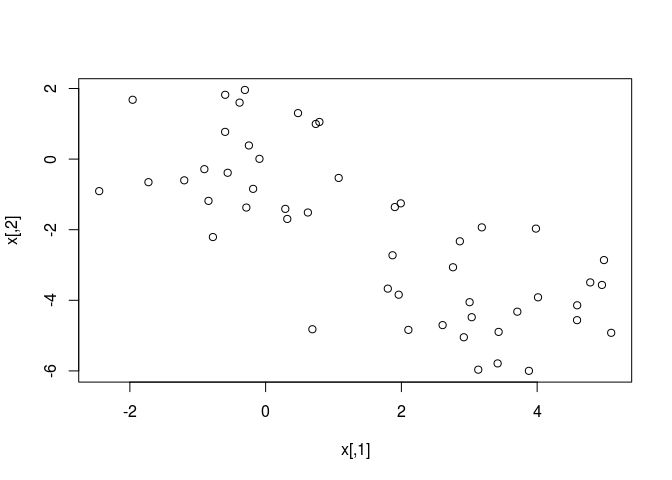

Clustering with K-Means:

``` r
km.out <- kmeans(x, 2, nstart = 20)
km.out$cluster
```

    ##  [1] 2 2 2 2 2 2 2 2 2 2 2 2 2 2 2 2 2 2 2 2 2 2 2 2 2 1 1 1 1 1 1 1 1 1 1
    ## [36] 1 1 1 1 1 1 1 1 1 1 1 1 1 1 1

What does the parameter *nstart* mean? It's the random sets number in algorithm 10.1, which is studied in the following codes.

Plot the clusters:

``` r
plot(x, col = (km.out$cluster + 1), main = 'K-Means clustering Result with K = 2', xlab = '', ylab = '', pch = 20, cex = 2)
```

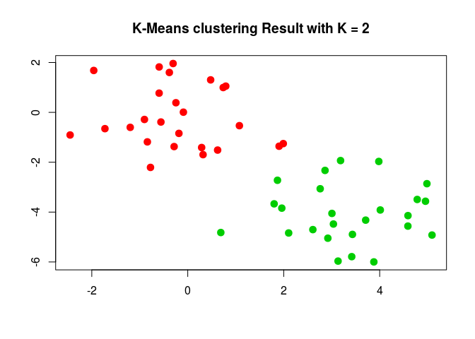

Clustering with `K = 3`:

``` r
set.seed(4)
km.out <- kmeans(x, 3, nstart = 20)
km.out
```

    ## K-means clustering with 3 clusters of sizes 10, 23, 17
    ## 
    ## Cluster means:
    ##         [,1]        [,2]
    ## 1  2.3001545 -2.69622023
    ## 2 -0.3820397 -0.08740753
    ## 3  3.7789567 -4.56200798
    ## 
    ## Clustering vector:
    ##  [1] 3 1 3 1 3 3 3 1 3 1 3 1 3 1 3 1 3 3 3 3 3 1 3 3 3 2 2 2 2 2 2 2 2 2 2
    ## [36] 2 2 2 2 2 2 2 2 1 2 1 2 2 2 2
    ## 
    ## Within cluster sum of squares by cluster:
    ## [1] 19.56137 52.67700 25.74089
    ##  (between_SS / total_SS =  79.3 %)
    ## 
    ## Available components:
    ## 
    ## [1] "cluster"      "centers"      "totss"        "withinss"    
    ## [5] "tot.withinss" "betweenss"    "size"         "iter"        
    ## [9] "ifault"

Compare clustering results using different *nstart* values:

``` r
set.seed(3)
km.out <- kmeans(x, 3, nstart = 1)
km.out$tot.withinss
```

    ## [1] 104.3319

``` r
km.out <- kmeans(x, 3, nstart = 20)
km.out$tot.withinss
```

    ## [1] 97.97927

As *km.out$tot.withinss* is the total within-cluster sum of squares, which we seek to minimize by performing K-means clustering (Equation 10.11), the results above shows that `nstart = 20` gives better result than `nstart = 1`.

Here the `set.seed()` function assure that the initial cluster assignments in Step 1 of algorithm 10.1 can be replicated, and the K-means output will be fully reproducible.

Hierarchical Clustering
-----------------------

Hierarchical clustering using complete linkage:

``` r
hc.complete <- hclust(dist(x), method = 'complete')
hc.average <- hclust(dist(x), method = 'average')
hc.single <- hclust(dist(x), method = 'single')
par(mfrow = c(1,3))
plot(hc.complete, main = 'Complete linkage', xlab = '', ylab = '', sub = '', cex = .9)
plot(hc.average, main = 'Average linkage', xlab = '', ylab = '', sub = '', cex = .9)
plot(hc.single, main = 'Single linkage', xlab = '', ylab = '', sub = '', cex = .9)
```

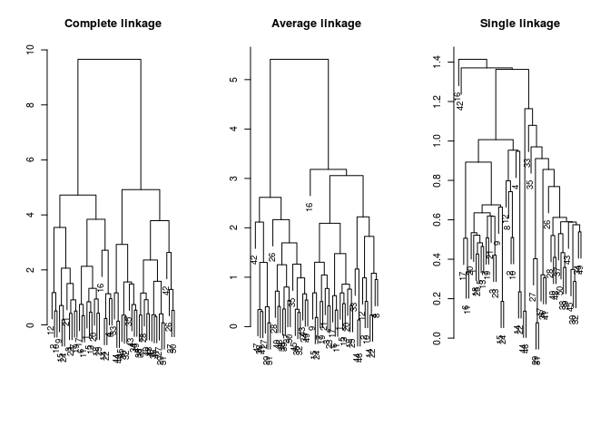

Determine the cluster labels for each observation associated with a given cut of the dendrogram with the `cutree()` function:

``` r
cutree(hc.complete, 2)
```

    ##  [1] 1 1 1 1 1 1 1 1 1 1 1 1 1 1 1 1 1 1 1 1 1 1 1 1 1 2 2 2 2 2 2 2 2 2 2
    ## [36] 2 2 2 2 2 2 2 2 2 2 2 2 2 2 2

``` r
cutree(hc.average, 2)
```

    ##  [1] 1 1 1 1 1 1 1 1 1 1 1 1 1 1 1 1 1 1 1 1 1 1 1 1 1 2 2 2 2 2 2 2 1 2 2
    ## [36] 2 2 2 2 2 2 2 2 1 2 1 2 2 2 2

``` r
cutree(hc.single, 2)
```

    ##  [1] 1 1 1 1 1 1 1 1 1 1 1 1 1 1 1 2 1 1 1 1 1 1 1 1 1 1 1 1 1 1 1 1 1 1 1
    ## [36] 1 1 1 1 1 1 1 1 1 1 1 1 1 1 1

`hc.single` gave wrong results.

Cut the tree with 4:

``` r
cutree(hc.single, 4)
```

    ##  [1] 1 1 1 1 1 1 1 1 1 1 1 1 1 1 1 2 1 1 1 1 1 1 1 1 1 3 3 3 3 3 3 3 3 3 3
    ## [36] 3 3 3 3 3 3 4 3 3 3 3 3 3 3 3

To scale the variables before performing hierarchical clustering of the observations, we use the `scale()` function:

``` r
xsc <- scale(x)
plot(hclust(dist(xsc), method = 'complete'), main = 'Hierarchical clustering with scaled features')
```

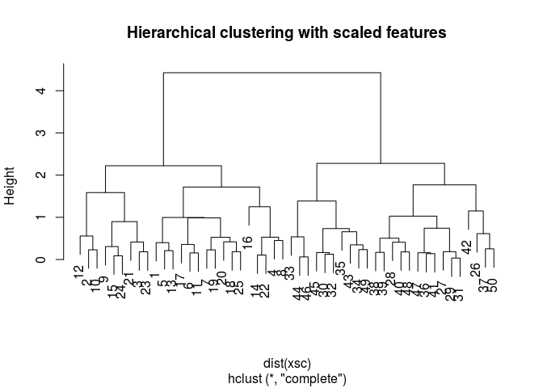

Clustering with correlation-based distance:

``` r
x <- matrix(rnorm(30 * 3), ncol = 3)
dd <- as.dist(1 - cor(t(x)))
plot(hclust(dd, method = 'complete'), main = 'Complete linkage with correlation-based distance', xlab = '', sub = '')
```

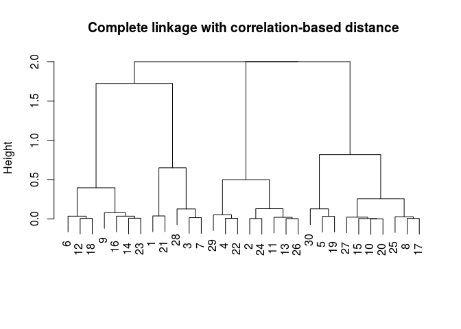

Lab 3: NCI60 Data Example
=========================

The dataset contains 64 observations, each has 6830 features:

``` r
library(ISLR)
nci.labs <- NCI60$labs
nci.data <- NCI60$data
dim(nci.data)
```

    ## [1]   64 6830

``` r
nci.labs[1:4]
```

    ## [1] "CNS"   "CNS"   "CNS"   "RENAL"

``` r
table(nci.labs)
```

    ## nci.labs
    ##      BREAST         CNS       COLON K562A-repro K562B-repro    LEUKEMIA 
    ##           7           5           7           1           1           6 
    ## MCF7A-repro MCF7D-repro    MELANOMA       NSCLC     OVARIAN    PROSTATE 
    ##           1           1           8           9           6           2 
    ##       RENAL     UNKNOWN 
    ##           9           1

PCA on the NCI60 Data
---------------------

Perform PCA on the dataset with scale:

``` r
pr.out <- prcomp(nci.data, scale. = TRUE)
```

Build a color function, each color for a unique cancer type:

``` r
cols <- function(vec) {
  colset <- rainbow(length(unique(vec)))
  return(colset[as.numeric(as.factor(vec))])
}
```

Plot the first 3 principal component score vectors(PC1 vs PC2, PC1 vs PC3):

``` r
par(mfrow = c(1,2))
plot(pr.out$x[, 1:2], col = cols(nci.labs), pch = 19, xlab = "Z1", ylab = "Z2")
plot(pr.out$x[, c(1,3)], col = cols(nci.labs), pch = 19, xlab = "Z1", ylab = "Z3")
```

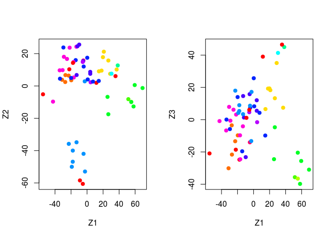

Print the summary of the PVE PCs (in the second of third line):

``` r
summary(pr.out)
```

    ## Importance of components:
    ##                            PC1      PC2      PC3      PC4      PC5
    ## Standard deviation     27.8535 21.48136 19.82046 17.03256 15.97181
    ## Proportion of Variance  0.1136  0.06756  0.05752  0.04248  0.03735
    ## Cumulative Proportion   0.1136  0.18115  0.23867  0.28115  0.31850
    ##                             PC6      PC7      PC8      PC9     PC10
    ## Standard deviation     15.72108 14.47145 13.54427 13.14400 12.73860
    ## Proportion of Variance  0.03619  0.03066  0.02686  0.02529  0.02376
    ## Cumulative Proportion   0.35468  0.38534  0.41220  0.43750  0.46126
    ##                            PC11     PC12     PC13     PC14     PC15
    ## Standard deviation     12.68672 12.15769 11.83019 11.62554 11.43779
    ## Proportion of Variance  0.02357  0.02164  0.02049  0.01979  0.01915
    ## Cumulative Proportion   0.48482  0.50646  0.52695  0.54674  0.56590
    ##                            PC16     PC17     PC18     PC19    PC20
    ## Standard deviation     11.00051 10.65666 10.48880 10.43518 10.3219
    ## Proportion of Variance  0.01772  0.01663  0.01611  0.01594  0.0156
    ## Cumulative Proportion   0.58361  0.60024  0.61635  0.63229  0.6479
    ##                            PC21    PC22    PC23    PC24    PC25    PC26
    ## Standard deviation     10.14608 10.0544 9.90265 9.64766 9.50764 9.33253
    ## Proportion of Variance  0.01507  0.0148 0.01436 0.01363 0.01324 0.01275
    ## Cumulative Proportion   0.66296  0.6778 0.69212 0.70575 0.71899 0.73174
    ##                           PC27   PC28    PC29    PC30    PC31    PC32
    ## Standard deviation     9.27320 9.0900 8.98117 8.75003 8.59962 8.44738
    ## Proportion of Variance 0.01259 0.0121 0.01181 0.01121 0.01083 0.01045
    ## Cumulative Proportion  0.74433 0.7564 0.76824 0.77945 0.79027 0.80072
    ##                           PC33    PC34    PC35    PC36    PC37    PC38
    ## Standard deviation     8.37305 8.21579 8.15731 7.97465 7.90446 7.82127
    ## Proportion of Variance 0.01026 0.00988 0.00974 0.00931 0.00915 0.00896
    ## Cumulative Proportion  0.81099 0.82087 0.83061 0.83992 0.84907 0.85803
    ##                           PC39    PC40    PC41   PC42    PC43   PC44
    ## Standard deviation     7.72156 7.58603 7.45619 7.3444 7.10449 7.0131
    ## Proportion of Variance 0.00873 0.00843 0.00814 0.0079 0.00739 0.0072
    ## Cumulative Proportion  0.86676 0.87518 0.88332 0.8912 0.89861 0.9058
    ##                           PC45   PC46    PC47    PC48    PC49    PC50
    ## Standard deviation     6.95839 6.8663 6.80744 6.64763 6.61607 6.40793
    ## Proportion of Variance 0.00709 0.0069 0.00678 0.00647 0.00641 0.00601
    ## Cumulative Proportion  0.91290 0.9198 0.92659 0.93306 0.93947 0.94548
    ##                           PC51    PC52    PC53    PC54    PC55    PC56
    ## Standard deviation     6.21984 6.20326 6.06706 5.91805 5.91233 5.73539
    ## Proportion of Variance 0.00566 0.00563 0.00539 0.00513 0.00512 0.00482
    ## Cumulative Proportion  0.95114 0.95678 0.96216 0.96729 0.97241 0.97723
    ##                           PC57   PC58    PC59    PC60    PC61    PC62
    ## Standard deviation     5.47261 5.2921 5.02117 4.68398 4.17567 4.08212
    ## Proportion of Variance 0.00438 0.0041 0.00369 0.00321 0.00255 0.00244
    ## Cumulative Proportion  0.98161 0.9857 0.98940 0.99262 0.99517 0.99761
    ##                           PC63      PC64
    ## Standard deviation     4.04124 2.148e-14
    ## Proportion of Variance 0.00239 0.000e+00
    ## Cumulative Proportion  1.00000 1.000e+00

Plot the PVE:

``` r
plot(pr.out)
```

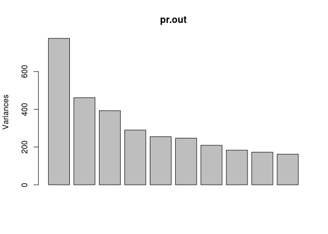

Plot the PVE of each PC:

``` r
pve <- 100 * pr.out$sdev ^ 2 / sum(pr.out$sdev ^ 2)
par(mfrow = c(1,2))
plot(pve, type = 'o', ylab = 'PVE', xlab = 'Principal Component', col = 'blue')
plot(cumsum(pve), type = 'o', ylab = 'Cumulative PVE', xlab = 'Principal Component', col = 'brown3')
```

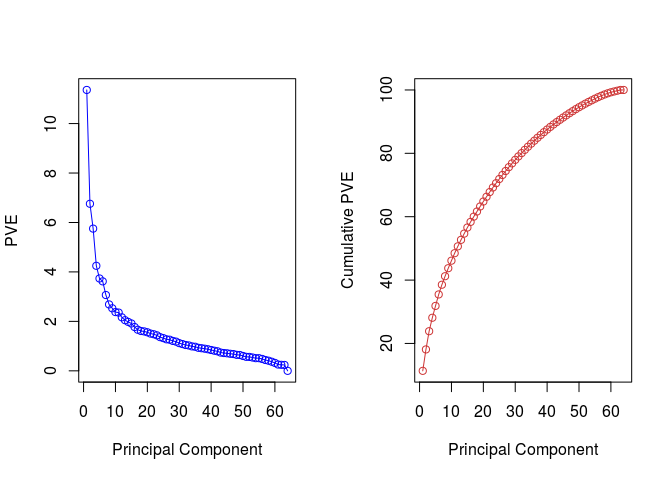

There's an *elbow* at about the 7th PC. The first 7 PCs explained about 40% of the variances.

Clustering the Observations of the NCI60 Data
---------------------------------------------

Standardize the clustered data and perform hierarchical clustering with different linkage methods and euclidean distance as the dissimilarity measure:

``` r
sd.data <- scale(nci.data)
par(mfrow = c(1,3))
data.dist <- dist(sd.data)
plot(hclust(data.dist), labels = nci.labs, main = 'Complete Linkage', xlab = '', ylab = '', sub = '')
plot(hclust(data.dist, method = 'average'), labels = nci.labs, main = 'Average Linkage', xlab = '', ylab = '', sub = '')
plot(hclust(data.dist, method = 'single'), labels = nci.labs, main = 'Single Linkage', xlab = '', ylab = '', sub = '')
```

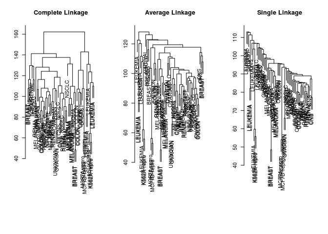

Complete linkage generates more balanced dendrogram.

Use the complete linkage, and cut the tree with 4 clusters:

``` r
hc.out <- hclust(data.dist)
hc.clusters <- cutree(hc.out, 4)
table(hc.clusters, nci.labs)
```

    ##            nci.labs
    ## hc.clusters BREAST CNS COLON K562A-repro K562B-repro LEUKEMIA MCF7A-repro
    ##           1      2   3     2           0           0        0           0
    ##           2      3   2     0           0           0        0           0
    ##           3      0   0     0           1           1        6           0
    ##           4      2   0     5           0           0        0           1
    ##            nci.labs
    ## hc.clusters MCF7D-repro MELANOMA NSCLC OVARIAN PROSTATE RENAL UNKNOWN
    ##           1           0        8     8       6        2     8       1
    ##           2           0        0     1       0        0     1       0
    ##           3           0        0     0       0        0     0       0
    ##           4           1        0     0       0        0     0       0

Plot the cut on the dendrogram that produces these four clusters:

``` r
par(mfrow = c(1,1))
plot(hc.out, labels = nci.labs)
abline(h = 139, col = 'red')
```

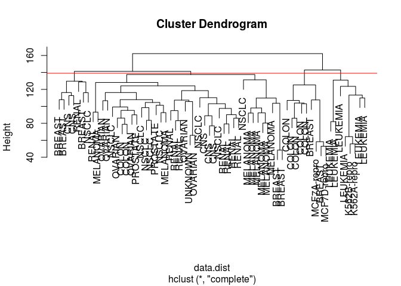

Brief summary of the clustering result:

``` r
hc.out
```

    ## 
    ## Call:
    ## hclust(d = data.dist)
    ## 
    ## Cluster method   : complete 
    ## Distance         : euclidean 
    ## Number of objects: 64

Compare K-Means and hierarchical clustering (HC) with `K=4`:

``` r
set.seed(2)
km.out <- kmeans(sd.data, 4, nstart = 20)
table(km.out$cluster, hc.clusters)
```

    ##    hc.clusters
    ##      1  2  3  4
    ##   1 11  0  0  9
    ##   2  0  0  8  0
    ##   3  9  0  0  0
    ##   4 20  7  0  0

Cluster no.2 of K-Means is the no.3 cluster of HC, no.3 of K-Means is no.1 of HC. While the other 2 clusters of K-Means spread in more than 1 clusters in HC respectively.

Perform HC on the first 5 PCs instead of the full dataset:

``` r
hc.out <- hclust(dist(pr.out$x[ , 1:5]))
plot(hc.out, labels = nci.labs, main = 'HC on First 5 Score Vectors')
```

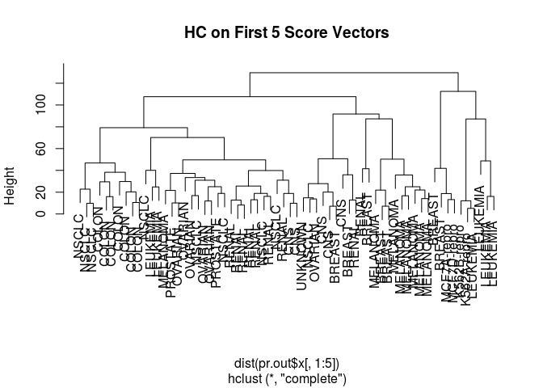

``` r
table(cutree(hc.out, 4), nci.labs)
```

    ##    nci.labs
    ##     BREAST CNS COLON K562A-repro K562B-repro LEUKEMIA MCF7A-repro
    ##   1      0   2     7           0           0        2           0
    ##   2      5   3     0           0           0        0           0
    ##   3      0   0     0           1           1        4           0
    ##   4      2   0     0           0           0        0           1
    ##    nci.labs
    ##     MCF7D-repro MELANOMA NSCLC OVARIAN PROSTATE RENAL UNKNOWN
    ##   1           0        1     8       5        2     7       0
    ##   2           0        7     1       1        0     2       1
    ##   3           0        0     0       0        0     0       0
    ##   4           1        0     0       0        0     0       0
